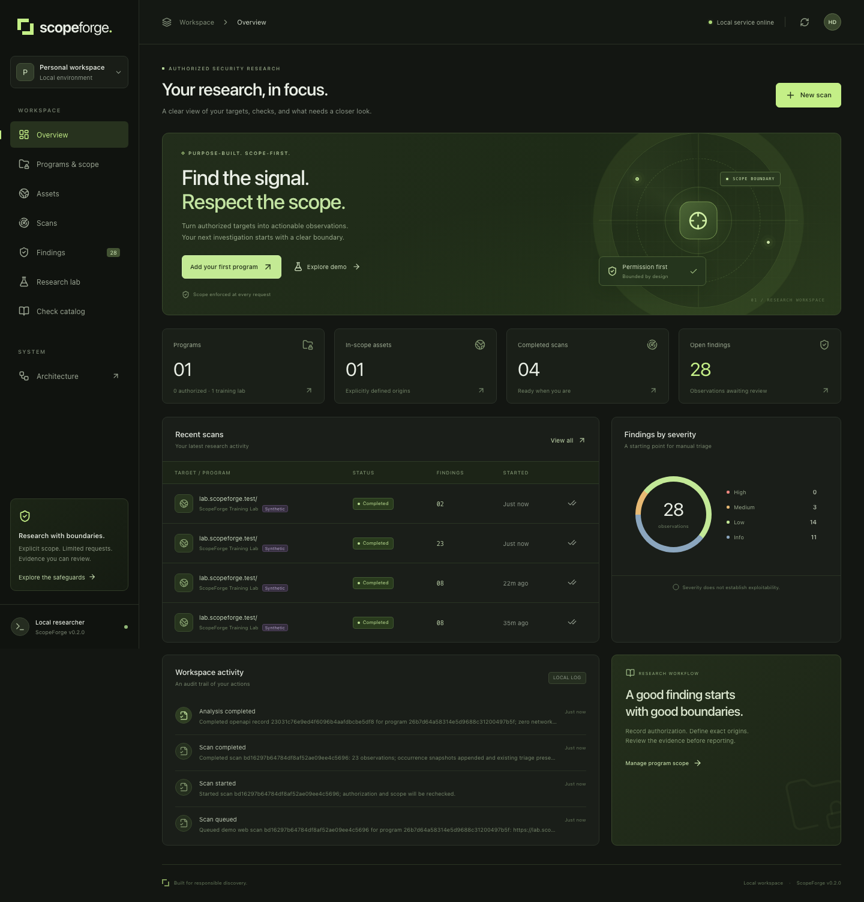

# ScopeForge

A local bug bounty workbench for documenting authorized scope, running bounded HTTP posture checks, reviewing evidence, and preparing reports.

ScopeForge 0.2 is a working single-user application with 52 implemented check families: 24 response-header checks, 13 static-HTML checks, and 15 OpenAPI design checks. It includes an offline research lab, evidence history, and a scalable architecture plan. It does not establish permission to test a target, prove that an observation is exploitable, or guarantee a bounty. The target owner's current program rules determine what you may test and report.



## Run locally

Prerequisites: Python 3.11+ and Node.js 22.12+ with npm. Dependencies stay in the project’s `.venv` and `frontend/node_modules`.

```sh
./scripts/setup.sh
./scripts/start.sh
```

Open [ScopeForge](http://127.0.0.1:8000). The server binds to loopback. Stop it with Ctrl+C. Start it again with `./scripts/start.sh`; records persist in `data/scopeforge.sqlite3`.

Choose **Explore demo** to exercise the scan-to-report workflow with synthetic response fixtures. The demo does not connect to a target. All demo findings are labelled synthetic.

## A real assessment

1. Read the program's policy and confirm that automated HTTP requests are permitted.
2. Add a program, policy URL, authorization note and expiration. Enter each permitted origin exactly, for example `https://app.your-authorized-domain.com`. Record excluded path prefixes and the required request interval.
3. Choose a permitted profile: response headers, or web posture including bounded static HTML. Queue one explicitly permitted URL or a batch of up to 20 URLs. Only default HTTP/HTTPS ports are supported. Queries, credentials, fragments and ambiguous encoded paths are rejected.
4. Review the finding’s evidence and remediation. Low-impact observations need manual validation of security impact. Use triage notes to record your analysis.
5. Export a Markdown report for review before submitting it through the program’s official channel.

Revoking a program prevents further scan requests. Cancellation prevents further processing; it cannot retract a network request already sent.

## What is implemented

- React/TypeScript dashboard with program scope, assets, scans, findings, a research lab, searchable check catalog, and architecture view.
- FastAPI API and SQLite WAL with a durable queue and transactional schema upgrades.
- Header and static-HTML profiles, explicitly selected in the program permission record; one GET per URL, no redirects.
- Atomic batches of 1–20 explicit URLs, a 100-job queue cap, per-program pacing, individual cancellation and stop-all.
- Offline HTTP capture and OpenAPI 3.0/3.1/3.2 JSON analysis, file input, and synthetic examples; zero target requests or DNS lookups.
- 52 documented rules covering transport, security headers, cookie protections, CORS signals, mixed content, password forms, integrity attributes, disclosure markers, and API security declarations. See [coverage and limitations](docs/COVERAGE.md).
- Exact-origin scope, path exclusions, authorization expiry/revocation, public-address validation, connection pinning, and verified TLS.
- Deduplicated findings with source/CWE metadata, first/last seen, occurrence snapshots, analyst notes/status, and manual evidence entry.
- Individual Markdown drafts and program Markdown/JSON exports with source-specific reproduction guidance.
- Local audit events, backup utility, backend/browser regression tests, and CI configuration.

The scanner sends an HTTP GET, so the API's historical `passive` mode name means a **low-impact request**, not traffic-free analysis. It does not crawl, submit forms, fuzz parameters, exploit vulnerabilities or run external scanner binaries.

For traffic-free research, open **Research lab**, load a synthetic HTTP or OpenAPI example, and select **Analyze offline**. Imports are limited to 256 KiB of JSON. Raw inputs and fetched response bodies are processed in memory and are not saved; selected observations and analyst-entered evidence are saved. The **Check catalog** explains the inputs and limits of every implemented rule. An observation count is not a count of proven exploitable vulnerabilities.

This release is for a single trusted local user. Team identity, multi-tenant isolation, distributed execution, tamper-evident audit storage and encrypted evidence storage are future work described in the architecture plan. Keep this release bound to loopback.

## Architecture and delivery plan

- [Version 0.2 changes](docs/CHANGELOG.md)
- [Implemented coverage and limitations](docs/COVERAGE.md)
- [Architecture, trust boundaries and scaling decisions](docs/ARCHITECTURE.md)
- [Phased delivery plan and acceptance criteria](docs/DELIVERY-PLAN.md)
- [Operations, recovery and release guidance](docs/OPERATIONS.md)
- [API contract](docs/API-CONTRACT.md)
- [Verification results and remaining validation](docs/VERIFICATION.md)

The local implementation uses one API process and one scan worker. The team design introduces PostgreSQL, independently scaled workers, explicit job leases, centralized budgets, controlled network egress and OIDC/RBAC. These are proposed components, not features already running in the local application.

## Development

Backend terminal, from the repository root:

```sh
.venv/bin/python -m uvicorn scopeforge.main:app --host 127.0.0.1 --port 8000 --workers 1
```

Frontend terminal:

```sh
npm --prefix frontend run dev
```

Use [the development dashboard](http://127.0.0.1:5173). Vite proxies `/api` to the backend. For the built dashboard, run `npm --prefix frontend run build`, then restart the backend.

## Verification

```sh
./scripts/check.sh
cd frontend
npx playwright install chromium
npx playwright test
```

Browser tests start an isolated local server and use offline fixtures. Neither the tests nor setup performs a scan of a third-party target. Package installation contacts package registries.

Stop the normal app before running browser tests; their isolated server reserves port 8000 and refuses to reuse an existing service.

## Backup

From the repository root:

```sh
.venv/bin/python scripts/backup.py backups/scopeforge-backup.sqlite3
```

The script uses SQLite's online backup API, checks integrity, creates a private file and refuses to overwrite an existing destination. Backups contain authorization records, target details and findings; store them with the same protections as your work directory. Restore only while the server is stopped; see the operations guide.

`SCOPEFORGE_DB` can point to a separate database path. For example:

```sh
SCOPEFORGE_DB=data/assessment.sqlite3 ./scripts/start.sh
```

## Optional container

```sh
docker compose up --build
```

The Compose configuration publishes port 8000 only on `127.0.0.1`, runs as a non-root user, drops capabilities and persists the database in a named volume. Docker is optional; it is not needed for local setup. The container configuration requires separate verification on a machine with Docker.

## Design references

The request boundary follows [OWASP SSRF prevention guidance](https://cheatsheetseries.owasp.org/cheatsheets/Server_Side_Request_Forgery_Prevention_Cheat_Sheet.html), including allowlisting, validating resolved addresses and disabling redirects. Permission records are designed around explicit program scope; [HackerOne's safe-harbor overview](https://docs.hackerone.com/en/articles/8494502-safe-harbor-overview-faq) explains that safe harbor does not expand the assets in scope. The service/worker deployment plan uses [FastAPI's deployment guidance](https://fastapi.tiangolo.com/deployment/docker/).
