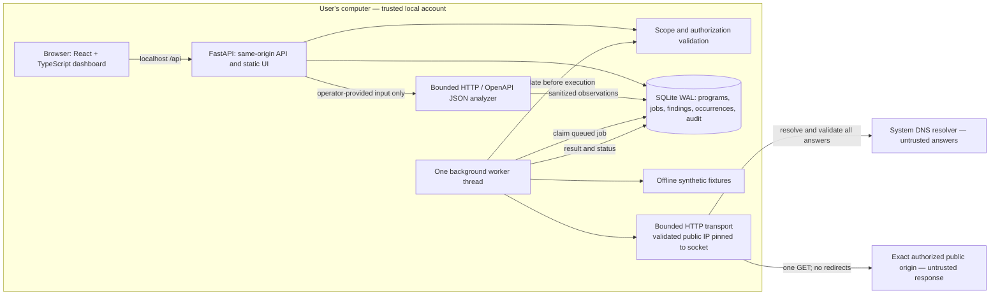
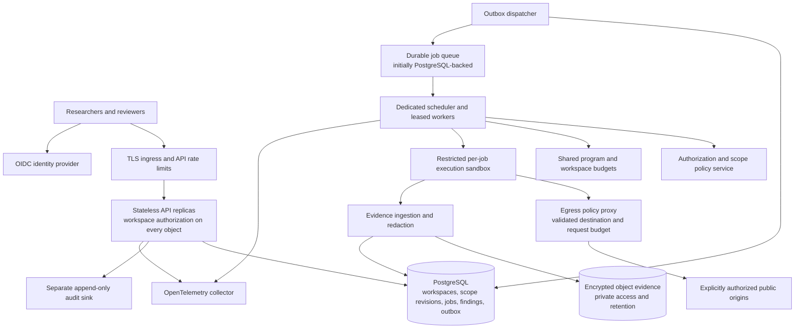

# ScopeForge architecture

ScopeForge is a local research workspace for authorized web security assessment. Version 0.2 combines program scope, header/static-HTML observations, offline HTTP/OpenAPI review, occurrence history, evidence triage, and report export in one dashboard. It is a foundation for a larger platform; it is not a production multi-user service or an automated promise of bounty income.

The user's selected deployment is **a local application with a web dashboard**. This document separates the local 0.2 architecture from proposed production work. The [API contract](API-CONTRACT.md) defines the present API; the [delivery plan](DELIVERY-PLAN.md) defines acceptance gates; [operations](OPERATIONS.md) covers deployment and recovery. Technical references were checked on 12 September 2026.

## Product and authorization boundary

The operator records a program policy URL, an authorization note, exact permitted origins, excluded path prefixes, an expiry, permitted check profiles, and a request interval. A recorded declaration is evidence of the operator's decision; the application cannot verify ownership, interpret every program policy, or guarantee legal protection or payment. Programs can restrict automation even when an asset is otherwise in scope. HackerOne explicitly says its safe harbor does not expand asset scope, and its disclosure guidance makes the individual program policy central to participation. [HackerOne safe harbor](https://docs.hackerone.com/en/articles/8494502-safe-harbor-overview-faq), [disclosure guidelines](https://www.hackerone.com/terms/disclosure-guidelines).

Each live job checks one explicitly supplied URL with one low-impact HTTP GET. The API calls this mode `passive`, but it **does send network traffic**. It does not crawl, follow redirects, infer subdomains, submit forms, fuzz parameters, authenticate to targets, attempt exploitation, or run external scanner binaries. The offline demo uses synthetic fixtures and sends no target requests. HTTPS and HTTP are separate origins; granting one does not grant the other. Only default ports and ASCII domain names are supported. Queries, fragments, credentials, percent-encoded paths, dot segments, duplicate slashes, and backslashes are rejected rather than normalized into a potentially different request.

Observations about headers, cookie attributes, or disclosed versions need contextual review. They are not proof of exploitability. Many bounty policies reject missing best practices or disclosures without demonstrated security impact; the product therefore separates confidence, severity, analyst status, and synthetic evidence. A report export is a local draft, and changing status to `reported` records the analyst's action rather than submitting anything externally. [HackerOne ineligible findings](https://docs.hackerone.com/en/articles/8494488-core-ineligible-findings).

## Local 0.2 components and data flow

React and TypeScript provide the research interface. Vite builds static assets; FastAPI serves the built dashboard and `/api` from one localhost origin. During development Vite proxies `/api`. Python keeps URL policy, the worker, and finding rules in the same language. SQLite's standard-library integration avoids a separate database service in the first installation.

The process owns one worker thread. API handlers persist scan requests before returning HTTP 202, and the worker consumes queued database rows. Queued work survives restart; a job found `running` at startup is marked `failed` with an interruption warning because a request might already have reached the target. The operator reviews it before creating another scan. There is no automatic replay of an ambiguous request. This is a durable local job list, not a distributed broker. Keep one application process: starting several ASGI worker processes would also start several scanner workers and invalidate the intended scheduling boundary. FastAPI's deployment documentation explains that process replicas do not share ordinary in-memory state. [FastAPI deployment concepts](https://fastapi.tiangolo.com/deployment/concepts/).

SQLite WAL allows readers to proceed alongside a writer, but still permits only one writer at a time and expects all users of the WAL to be on the same machine. Keep transactions short and use a local filesystem. SQLite provides persistence, not horizontal scalability or protection against a compromised local account. [SQLite WAL](https://www.sqlite.org/wal.html).

### Request lifecycle

1. The dashboard sends a mutation with `X-ScopeForge-Client: dashboard`. The server applies local host/origin checks and validates JSON. The marker is a browser request safeguard, not a password or user identity.
2. Program creation records the authorization declaration. The policy URL is a reference; it is never used to infer permitted targets or automatically fetched for scope.
3. Scan admission canonicalizes the target, checks exact origin membership, excluded paths, active authorization, future expiry, and the permitted profile, then persists a queued job. Batch admission validates all 1–20 canonical, distinct URLs and reserves queue capacity in the same transaction; any rejection creates no jobs.
4. The worker reloads the current program and checks authorization and scope again at execution. A queued job does not preserve a right to scan after revocation or expiry.
5. Real-mode transport validates DNS addresses and connects to a validated public address while retaining the intended HTTP Host and HTTPS hostname verification. It does not follow a redirect to a new destination. Demo mode cannot switch into real networking.
6. Rules consume response headers. The permitted `web` profile additionally reads up to 128 KiB of uncompressed HTML/XHTML within the overall 256 KiB response cap. Redirects, ambiguous content types, and encoded bodies skip HTML analysis with a reason. No scripts execute and no links are followed. Raw bodies remain in memory; only selected observations and summary metadata are persisted with a terminal scan state.
7. The analyst reviews evidence, adds notes, dismisses or validates an observation, and exports a Markdown draft. Synthetic findings remain labelled synthetic throughout this journey.

Cancellation is cooperative. A request already sent cannot be recalled. The worker should avoid starting new network work after it observes cancellation or revocation; there remains a small race between the final authorization check and socket activity. This release has no claim of exactly-once HTTP delivery, cryptographically proven authorization, or an instantaneous remote kill switch.

Request reservations are persisted per program and spaced by its configured interval, from 1,000 to 60,000 milliseconds. The worker rechecks permission and refreshes the pacing timestamp immediately before the first HTTP write, after connection and TLS setup; this prevents a slow handshake from shortening the next request interval. During a pacing wait the worker checks cancellation/shutdown at most every 250 milliseconds. `requests_made` counts reserved attempts, not remotely confirmed receipt; a TLS or connection failure can consume the one attempt without the target receiving a GET. Cancellation, revocation, or expiry observed before results are committed prevents those in-flight findings from being saved.

The DNS result wait is limited to 5 seconds through a shared two-thread resolver pool. Timing out discards that result, but cannot forcibly terminate an OS resolver call already running. The HTTP transport applies a 10-second request deadline and caps response consumption, including headers and parser buffering, at 256 KiB. It attempts only the first validated address and does not retry another IP. These bounds constrain application work; they are not a guarantee that the remote server sends only that many bytes.

The running catalog exposes 52 check families: 24 header rules, 13 static-HTML rules, and 15 OpenAPI design rules. Only applicable rules produce observations. No injected Origin, authenticated request, or exploit test is used to establish impact. Cookie values, technology header values, redirect destinations, and captured body text are omitted from stored automated evidence. [Coverage and parser limitations](COVERAGE.md) describes the inputs and conservative interpretation.

### Offline analysis lifecycle

Imports are processed synchronously in FastAPI's thread pool and never enter the network queue. Admission validates scope, authorization and the claimed evidence target. The HTTP capture/OpenAPI JSON parser limits UTF-8 input to 256 KiB, nesting to 40 levels, and parsed nodes to 50,000. Only local bounded OpenAPI references can be resolved; external references are never fetched. The request envelope is limited to 1 MiB, allowing escaped JSON, while other API bodies remain limited to 32 KiB. Validation errors omit rejected input values.

Before committing an import or manual record, a transaction reloads program authorization and scope to handle revocation during analysis. Each produces a completed zero-request scan with explicit provenance. Imports do not claim that a live target was contacted, that the capture is current, or that document declarations reflect deployed enforcement. Described API paths and servers do not expand live scope. Raw input is not persisted. Manual evidence and notes are retained as supplied and require operator redaction.

### Data model

`Program` owns scope origins, authorization metadata, exclusions, expiry, pacing, demo status, and allowed profiles. `Asset` is a view of explicitly recorded program origins, not a discovery engine. `Scan` records target, mode, state, timestamps, request count, error, executed checks, profile, source, and analysis summary. `Finding` belongs to a scan and program and separates rule identity, description, impact, evidence, confidence, severity, analyst notes, and review status. `FindingOccurrence` holds an immutable application-level snapshot of sanitized evidence per finding and scan. `AuditEvent` records application actions and timestamps.

Finding identity is `(program_id, target_url, check_id)`. Repeated observations refresh current evidence and the linked scan while preserving analyst status and notes. First/last-seen timestamps and an occurrence counter are updated; every observation appends a separate snapshot. The history endpoint returns the latest 100 occurrences. A later absence does not automatically resolve a finding. Imported HTTP IDs use an `import-http:` prefix and OpenAPI IDs an `openapi:` prefix so their provenance does not collide with live rules. The active queue is capped at 100 jobs; list endpoints return at most 500 recent scans, 2,000 findings, and 500 audit events. Older records remain in the database, but cursor pagination and a complete searchable history are phase 2 work.

The scan states are `queued`, `running`, `completed`, `failed`, and `cancelled`. Findings use `open`, `validated`, `dismissed`, and `reported`. The audit list helps local traceability but is editable by someone with database access. Schema version 2 migrates existing local records transactionally, backfills one legacy occurrence per existing finding, and refuses newer unsupported schemas. These local snapshots are editable by someone with database access. This release does not have workspace membership, row-level access control, externally immutable evidence storage, or versioned authorization revisions. These are deliberate production gates, not hidden guarantees.

## Trust boundaries and threat model

The main assets are authorization records, private findings and notes, the operator's machine, and target availability. Consider malicious remote pages, hostile DNS answers, arbitrary URLs, another website attempting browser-to-local requests, malformed evidence, and accidental operator mistakes. Local administrator compromise and a user deliberately modifying the code or database are outside the local protection boundary.

### Browser to local API

Only loopback deployment is supported. A hostile website must not be able to enqueue a scan through an ambient browser request; host/origin validation and a required custom mutation header support this boundary. The server must independently validate scope because frontend validation is bypassable. Evidence and names are rendered as text, never executable HTML. Host checks also matter for DNS rebinding against the local dashboard. These controls do not isolate two users sharing one OS account and do not make a forwarded local port safe for team access.

### Worker to network

Exact-origin allowlisting prevents a permitted host from granting permission to siblings or lookalikes. Resolve A/AAAA answers, reject non-public destinations, pin the validated connection address, preserve TLS verification, and disable redirects. This design follows OWASP's recommendations to validate resolved addresses and avoid redirect-based validation bypasses. It does not replace a network-level egress firewall. Parser ambiguity, encoded paths, IPv4-mapped IPv6, changing DNS answers, and redirects are explicit regression-test categories. [OWASP SSRF prevention](https://cheatsheetseries.owasp.org/cheatsheets/Server_Side_Request_Forgery_Prevention_Cheat_Sheet.html).

Even a GET can trigger side effects on a poorly designed target. The operator should select a known ordinary page allowed by the program and exclude logout, action, administrative, or other sensitive routes as appropriate. A request budget and minimum interval constrain intended traffic; they cannot certify remote behavior. Public IP validation also cannot prove that a public service belongs to the authorizing organization.

### Remote evidence to local storage

Response content and imported files are untrusted. The app inspects headers and bounded static HTML without executing target JavaScript, rejects query strings in target URLs, and persists selected redacted observations rather than a raw response. The operator's program notes and target paths can still contain private information. The local application stores its database locally without application-level encryption. Use the OS account and disk protections described in operations; do not treat a private program URL as public telemetry. Imports avoid storing raw input and raw validation payloads; manual evidence remains the operator’s responsibility. Future richer ingestion must preserve these boundaries and instrument exports. OWASP advises protecting logs from tampering and avoiding direct storage of tokens, passwords, and sensitive personal data. [OWASP logging](https://cheatsheetseries.owasp.org/cheatsheets/Logging_Cheat_Sheet.html).

### Application to job execution

Every job must carry its program reference, mode, and explicit target. Demo jobs can only use the seeded demo program, and real jobs must reject it. Unknown states fail closed. Scope validation occurs when admitted and when executed. A worker exception becomes a visible job failure; an empty result is not evidence that an application is secure. The local deployment is one trust zone: a worker parser bug can affect the API process. Separate execution becomes mandatory before running third-party rule engines or accepting remote users.

## Proposed production architecture — not implemented

Begin the hosted version with a modular monolith API and separate worker processes. PostgreSQL is the authoritative state store. A dedicated PostgreSQL-backed queue avoids an immediate second state system; claim a batch of ready rows with short transactions and `FOR UPDATE SKIP LOCKED`, then release locks before doing network work. PostgreSQL documents this as a use case for queue-like tables, while warning that skipped locked rows are not a generally consistent query view. [PostgreSQL SELECT](https://www.postgresql.org/docs/current/sql-select.html).

A job has `workspace_id`, `program_id`, `scope_revision_id`, `run_id`, `idempotency_key`, `lease_owner`, `lease_expires_at`, `attempt`, and a policy/rule version. Workers renew leases and commit with a fencing token so an expired worker cannot overwrite a newer result. Unique idempotency keys prevent duplicate admission; a unique result identity prevents duplicate persistence. External GET delivery remains at least once in the presence of ambiguous network failures. A lost acknowledgement must not trigger an automatic retry that breaches the request budget. Check policy, remaining budget, cancellation, and expiry on every attempt.

If job fan-out or database contention warrants a broker, use a transactional outbox to bridge PostgreSQL to RabbitMQ/Celery or a managed durable queue. Broker messages contain opaque job IDs; the database retains ownership, policy, and terminal state. Acknowledgement follows result persistence. Put exhausted retries in a dead-letter workflow that requires diagnosis, not unlimited replay. FastAPI itself recommends a separate task system for work requiring execution across processes or servers. [FastAPI background tasks](https://fastapi.tiangolo.com/tutorial/background-tasks/).

Workers receive short-lived job capabilities and no database administrator credentials. Run non-root with a read-only base filesystem, temporary working directory, CPU/memory/time limits, and no cloud metadata access. The sandbox can reach targets only through an egress proxy that enforces exact scope and public destination checks. Control-plane access is separate from target traffic. A proxy failure stops scanning. Network policy is defense in depth; if Kubernetes is introduced, verify the chosen network plugin actually enforces policies and test default-deny egress. Kubernetes policies alone are not a URL/path authorization engine. [Kubernetes NetworkPolicy](https://kubernetes.io/docs/concepts/services-networking/network-policies/).

OIDC supplies identity, while the API supplies workspace roles: owner, researcher, reviewer, and read-only. Check both membership and object workspace on every query, export, job, and evidence URL. Add short-lived signed evidence downloads, encrypted object storage, key rotation, retention/deletion workflows, secrets management, and separate append-only audit storage. Record scope revisions and policy acknowledgement so an investigation can reconstruct what was permitted when a request was sent.

Keep the React dashboard and the public API concepts. Add pagination, bounded filters, OpenAPI-generated client types, optimistic concurrency for analyst updates, and SSE only if polling becomes material. Avoid a generic plugin shell: integrations should have typed input/output, a declared risk class, resource limits, and versioned tests. Richer future workflows may import authorized proxy captures or SARIF, compare owned OpenAPI coverage, and correlate observations; each data source needs workspace access controls and evidence redaction before use.

## Sizing assumptions and graduation triggers

These are planning inputs to validate with measurements, not tested capacity claims.

- **Local release:** one operator, one process, one worker, up to roughly 50 programs and 1,000 submitted checks per day. At an assumed mean of 5 seconds of occupied worker time per check, 1,000 checks consume about 83 minutes. A 20-second slow-target workload consumes about 5.6 hours. Pacing and policy limits can dominate both numbers.
- **Initial team pilot:** assume 20 researchers, 200 programs, and 10,000 jobs per day, or about 0.116 jobs/second on average. A tenfold burst is about 1.16 jobs/second. If measured worker occupancy averages 10 seconds and target utilization is at most 60%, estimated concurrency is `arrival_rate × occupancy / 0.6`: about 2 average slots and 20 burst slots. Per-program limits override available fleet capacity.
- **Evidence:** at an assumed 50 KB of retained evidence per job, 10,000 jobs/day produces about 0.5 GB/day or 45 GB for 90 days before indexes, replicas, backups, and object overhead. The current local application may use much less; measure before provisioning. Large captures can change this by orders of magnitude.

Move to the production design **before** adding remote or multiple independent users, multiple application processes, or third-party scanner execution, even at low traffic. Introduce PostgreSQL and pagination when measured lock contention, list latency, retention, or recovery needs exceed the local acceptance envelope. Separate workers when CPU or target latency interferes with dashboard responsiveness. Consider a broker when database queue load demonstrably competes with product queries. Consider Kubernetes only when fleet management, workload isolation, or availability requirements justify its operational cost.

## Reliability and observability proposals

The local app has no uptime SLA. Laptop sleep, process exits, disk space, and the target network affect execution. Proposed targets for the team pilot are: 99.5% API availability per calendar month, p95 ordinary read latency below 300 ms at the agreed pilot load, and p95 dispatch within 30 seconds for jobs currently eligible under their program budgets. A job intentionally waiting for authorization or a rate limit is not dispatch-eligible. Measure queue age separately to avoid hiding starvation.

Propose an RPO of 24 hours and RTO of 2 hours for an operator-backed-up local installation. For a managed pilot, propose RPO of 15 minutes and RTO of 4 hours until restore drills support tighter goals. These are planning goals, not current guarantees. PostgreSQL point-in-time recovery needs a usable base backup and the associated archived WAL; retain and test both. [PostgreSQL continuous archiving](https://www.postgresql.org/docs/current/continuous-archiving.html).

Instrument job admission, queue eligibility/age, lease expiry, target duration, scope rejection, rate-limit waits, cancellation latency, parser failures, database busy time, and evidence volume. Use metrics, traces, and structured events through OpenTelemetry, with job identifiers for correlation and low-cardinality labels. Do not put full target URLs, credentials, or evidence into telemetry labels or trace baggage. OpenTelemetry is the collection/export layer; a metrics and trace backend is still needed. [OpenTelemetry signals](https://opentelemetry.io/docs/concepts/signals/).

## Architecture decision records

### ADR-001 — Local web application

**Status:** Accepted for v1. **Date:** 2026-09-12. **Decision owner:** project maintainer.

**Context:** The first user chose local operation and a web dashboard. Installation should not require cloud credentials or a database service.

**Decision:** React + TypeScript + Vite, FastAPI, standard-library SQLite WAL, and one in-process worker thread.

**Options considered:** A Python server-rendered UI reduces frontend tools but makes the interactive triage workspace less flexible. A TypeScript-only server reduces language count but does not provide a particular advantage for the planned Python research pipeline. Electron/Tauri supplies native packaging but adds signing, update, and packaging work before the research workflow is proven. A hosted service adds identity and tenant-isolation responsibilities immediately.

**Consequences:** Easy local startup and one durable state store; two application languages and one process failure domain. Keep one ASGI worker. Native packaging remains a later distribution option. Action: retain this decision until user access or execution isolation requirements change.

### ADR-002 — Conservative, explicit network scope

**Status:** Accepted for v1. **Date:** 2026-09-12. **Decision owner:** project maintainer.

**Context:** An assistant intended for bounty work must preserve the operator's permitted boundaries while giving a reproducible first workflow.

**Decision:** Exact origins, expiring recorded authorization, exclusions, public-IP validation, one URL/GET per real scan, no redirect following, and an offline fixture demo.

**Options considered:** Broad crawler/exploit-tool orchestration expands coverage but requires substantially richer authorization, isolation, and request budgets. An import-only app has no target-network exposure but cannot produce its own fresh HTTP observations. The selected small transport provides useful triage while keeping the request surface reviewable.

**Consequences:** Limited discovery depth and false-negative coverage; many observations are low or informational and need analyst review. URL policy and transport become security-critical code. Action: gate every future request type and tool adapter on a threat model, policy semantics, and adversarial tests.

### ADR-003 — Evolve the database queue before adding a broker

**Status:** Proposed for team release. **Date:** 2026-09-12. **Decision owner:** future platform maintainer.

**Context:** Multi-process execution needs durable claims, leases, cancellation, shared rate limits, and recoverable state transitions.

**Decision:** PostgreSQL state plus a dedicated leased worker queue first; add an outbox and broker only after measured pressure or routing requirements justify it.

**Options considered:** Redis/RQ is simple to deploy but adds another durability/ownership boundary. RabbitMQ/Celery provides mature routing and worker tooling but adds broker operations and acknowledgement semantics. A managed queue removes broker host maintenance but adds provider coupling and visibility-timeout considerations. A PostgreSQL queue keeps admission and job state transactional but needs deliberate lease, fairness, cleanup, and query design.

**Consequences:** Less infrastructure initially; queue contention must be measured. HTTP side effects cannot be made exactly once by a database transaction. Action: implement crash, duplicate-delivery, and fencing tests before enabling a second worker.

### ADR-004 — Isolate execution before expanding capability

**Status:** Proposed; mandatory before hosted or third-party worker execution. **Date:** 2026-09-12. **Decision owner:** future security/platform maintainer.

**Context:** Target responses and imported artifacts are attacker-controlled, and a powerful research worker should not inherit control-plane network access or secrets.

**Decision:** Separate restricted worker sandboxes, a policy-enforcing egress proxy, and encrypted evidence storage with short-lived access.

**Options considered:** Running all tools in the API is operationally simple but shares the full compromise boundary. A container alone constrains some resources but does not enforce target ownership or path scope. Separate virtual machines can strengthen isolation but increase startup and operating costs. Begin with restricted workers and verified egress controls; evaluate stronger per-job isolation against the actual tool set.

**Consequences:** More infrastructure, policy synchronization, and troubleshooting work. New capabilities remain unavailable until isolation tests pass. Action: document a malicious-response/import threat model and demonstrate network-denial tests from inside the real worker runtime.
